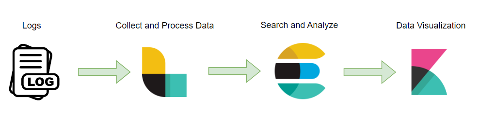
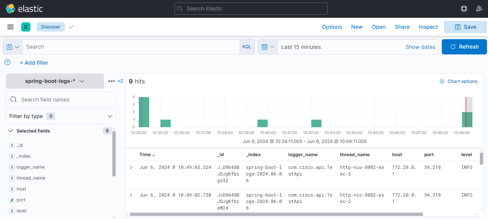

# Spring Boot ELK Monitoring

The ELK stack provides a powerful and flexible way to aggregate, search, and visualize logs from a Spring Boot application. By setting up this stack, you can gain deep insights into your application's behavior, performance, and issues, helping you to maintain and improve the application effectively.

## How the ELK Stack Works



The ELK stack consists of three primary components:

1. **Elasticsearch**
   - **Role**: Elasticsearch is a distributed, RESTful search and analytics engine. It stores the logs and provides powerful search capabilities.
   - **Function**: It indexes the incoming log data from Logstash, making it searchable.

2. **Logstash**
   - **Role**: Logstash is a data processing pipeline that ingests data from multiple sources, processes it, and then sends it to a stash like Elasticsearch.
   - **Function**: It collects the log data from various sources (in our case, the Spring Boot application), processes the logs (e.g., filtering, parsing), and forwards them to Elasticsearch.

3. **Kibana**
   - **Role**: Kibana is a data visualization and exploration tool. It allows you to visualize and explore data stored in Elasticsearch.
   - **Function**: It provides a web-based interface to search, view, and analyze logs stored in Elasticsearch.

## Journey of Spring Boot Logs in ELK Stack

1. **Log Generation:**
- The Spring Boot application generates logs as it runs. These logs can include various levels of information such as `INFO`, `DEBUG`, `WARN`, `ERROR`, etc.

2. **Log Transmission to Logstash:**
- **Logback Configuration:** Using the Logback framework, the Spring Boot application is configured to send logs to Logstash via a TCP connection on port 5044. The logs are formatted in JSON for easy parsing.
- **Code Snippet:** The `logback-spring.xml` file in the Spring Boot application specifies the destination for the logs.

```angular2html
<appender name="LOGSTASH" class="net.logstash.logback.appender.LogstashTcpSocketAppender">
    <destination>localhost:5044</destination>
    <encoder class="net.logstash.logback.encoder.LogstashEncoder"/>
</appender>

<root level="INFO">
    <appender-ref ref="LOGSTASH"/>
</root>
```

3. **Log Ingestion by Logstash:**
- **Input Configuration:** Logstash listens on port 5044 for incoming logs using the TCP input plugin and JSON codec.
```angular2html
input {
  tcp {
    port => 5044
    codec => json
  }
}
```
- **Processing:** Logstash can process the logs, though in this basic setup, we might not need additional processing.

- **Output Configuration:** Logstash forwards the processed logs to Elasticsearch.
```angular2html
output {
  elasticsearch {
    hosts => ["http://elasticsearch:9200"]
    index => "spring-boot-logs-%{+YYYY.MM.dd}"
  }
  stdout {
    codec => rubydebug
  }
}
```

4. **Log Storage in Elasticsearch:**
- The logs are indexed and stored in Elasticsearch in an index named based on the date (e.g: `spring-boot-logs-2023.05.01`).

5. **Log Visualization in Kibana:**
- **Kibana Interface:** Users access Kibana via `http://localhost:5601`.
- **Index Pattern Configuration:** In Kibana, users create an index pattern (e.g: `spring-boot-logs-*`) to match the indices created by Logstash in Elasticsearch.
- **Log Exploration:** Users can navigate to the Discover section in Kibana to view and search through the logs.
- **Visualizations and Dashboards:** Users can create various visualizations (e.g: line charts, bar graphs, pie charts) based on log data and combine these visualizations into dashboards to monitor application performance and identify issues.



## Insights from Visualized Logs
- **Error Tracking**: Quickly identify and investigate errors and exceptions in the application.
- **Performance Monitoring**: Monitor the response times, request rates, and other performance metrics.
- **Usage Patterns**: Understand how users are interacting with the application by analyzing access logs.
- **Security Analysis**: Detect potential security threats by monitoring login attempts, access patterns, etc.
- **Operational Monitoring**: Keep an eye on the health and behavior of the application, such as memory usage, garbage collection logs, etc.

## Example Insights Using Kibana

**Discover Section:**
- Search through logs using Kibana’s powerful query language.
- Filter logs by time range, log level, message content, etc.

**Visualizations:**
- **Line Chart:** Visualize the number of error logs over time to detect trends.
- **Bar Chart:** Compare log counts by log level (`INFO`, `WARN`, `ERROR`).
- **Pie Chart:** Show the distribution of log levels.

**Dashboards:**
- Combine multiple visualizations into a single dashboard to get a comprehensive view of the application's health and performance.
- Example Dashboard Widgets:
  - Error rate over time
  - Most common log messages
  - Average response time
  - Number of requests per endpoint

## Steps
1. Start ELK Stack - `docker-compose up`
2. Run Spring Boot Application
3. Visualize Logs in Kibana 
   - Access Kibana at `http://localhost:5601`.
   - Navigate to `Management > Kibana > Index Patterns`.
   - Click Create index pattern.
   - Enter `spring-boot-logs-*` as the index pattern.
   - Navigate to Discover to view the ingested logs.
   - Create visualizations and dashboards as needed.


